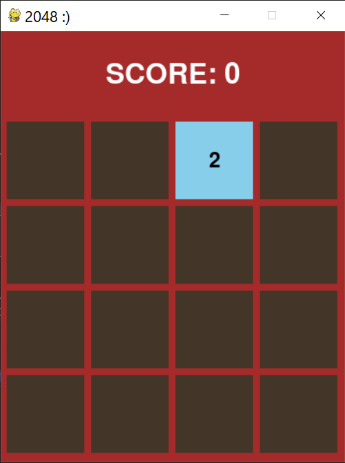
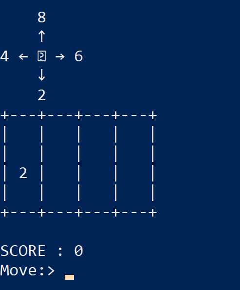

# 2048 Game
The **2048 Game** is a sliding tile puzzle built using Python and Pygame. Players combine tiles with matching numbers by sliding them in four directions to create the 2048 tile while maximizing their score. The game features a dynamic grid, random tile generation, and a real-time scoring system. It provides an interactive experience and showcases the implementation of grid-based logic and 2D game development concepts.

---
### How To Run?
1. Clone the Repository
   ```
   git clone https://github.com/RohitMugalya/2048-game.git
   cd 2048-game
   ```
2. Ensure you've python 3.6 or higher
3. install the `pygame` package using the command
    ```commandline
    pip install pygame
    ```
4. To run in Graphical User interface
    ```
    python gui2048.py
    ```
   
5. To run in Command Line Interface
   ```
   python cli2048.py
   ```
   
---
### Contributing
Feel free to fork the repository, make improvements, or open an issue if you find any bugs or have suggestions for enhancements.

---
#### Until next time
*Happy Coding :)*